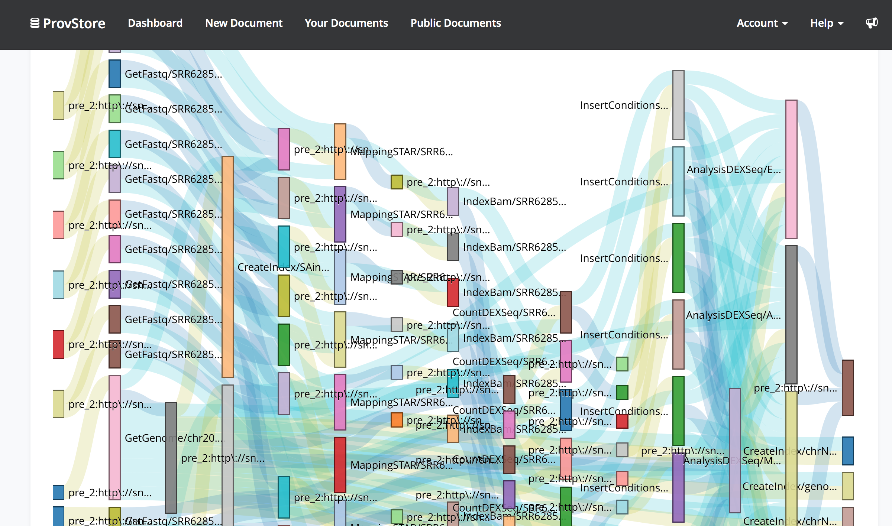
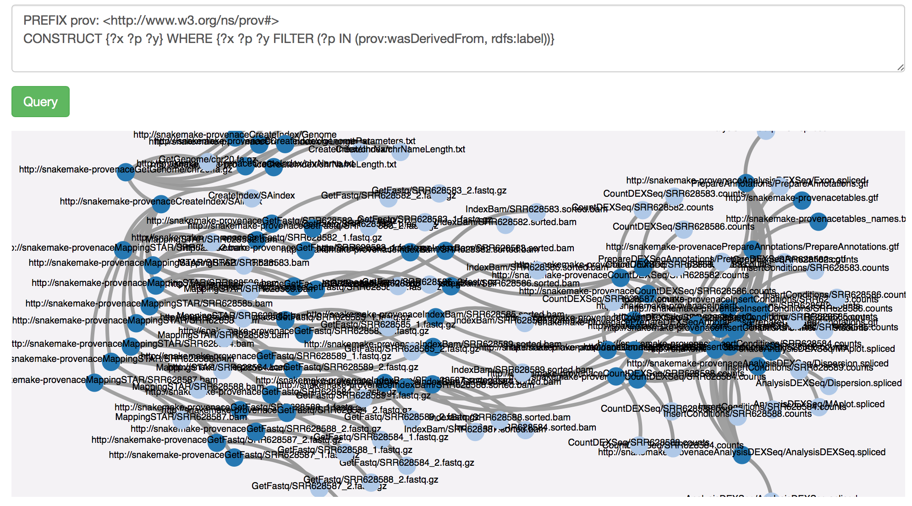

# Provenance capture
We worked on a SnakeMake extension to capture provenance information for WF execution sharing and reuse purpose. 
The provenance ere captured in RDF (turtle) by running a simulation (dry run) of the snakemake workflow developed by team snake1.

 
The provenance of the workflow has also been made available on ProvStore: https://provenance.ecs.soton.ac.uk/store/documents/116301

A visualization from ProvStore:

A filtering (data derivation chains only) made with a CONSTRUCT SPARQL query:

