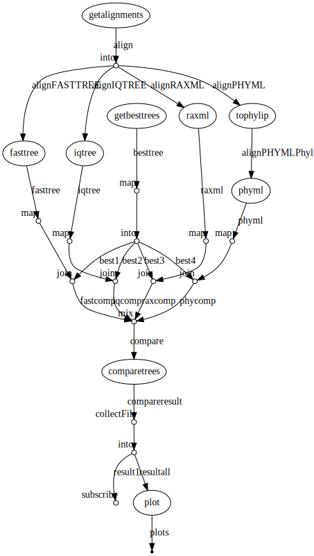
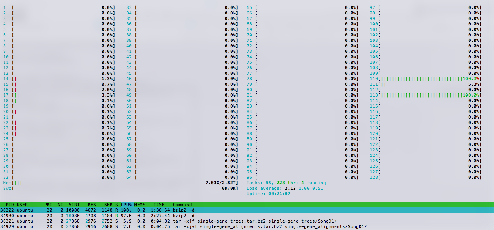
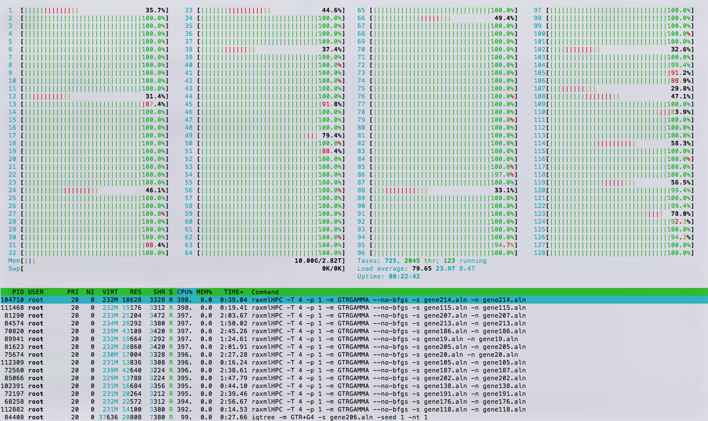
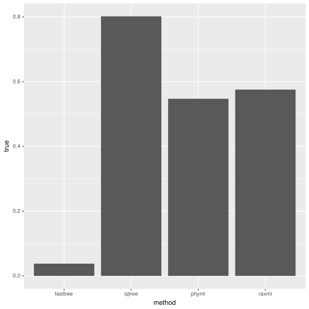
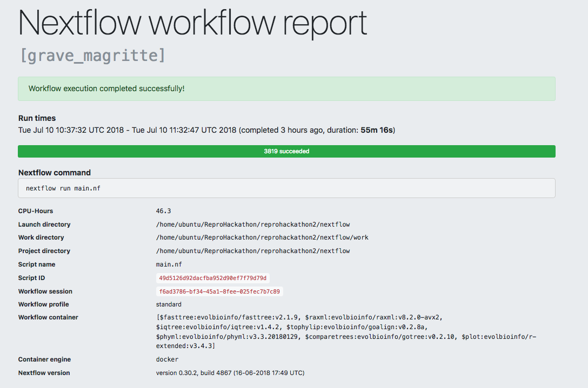
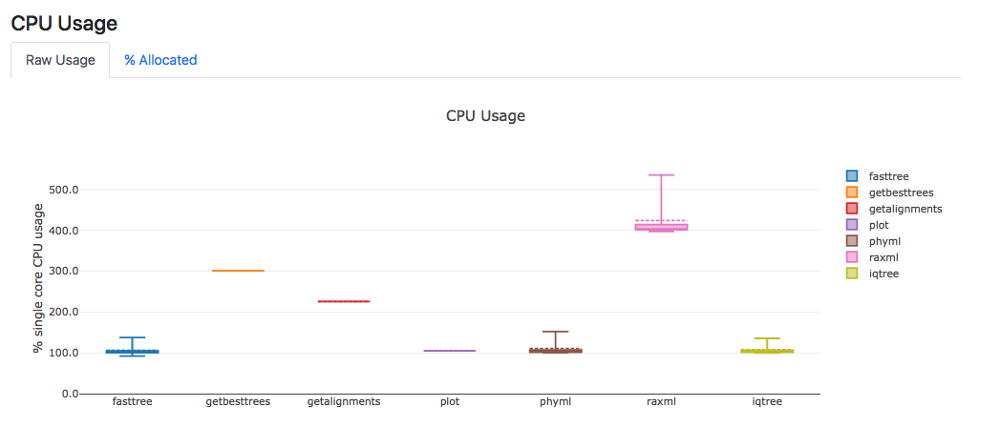
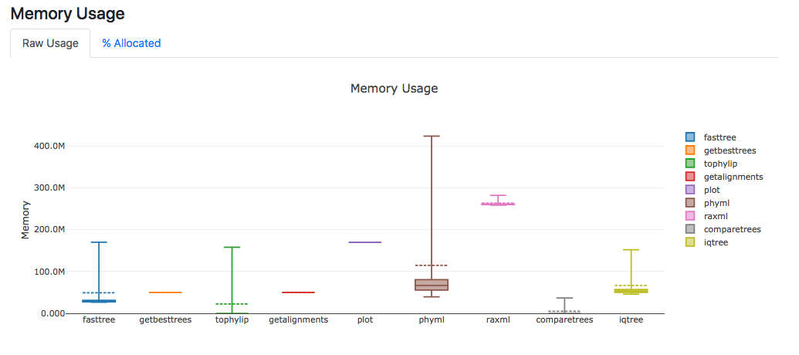
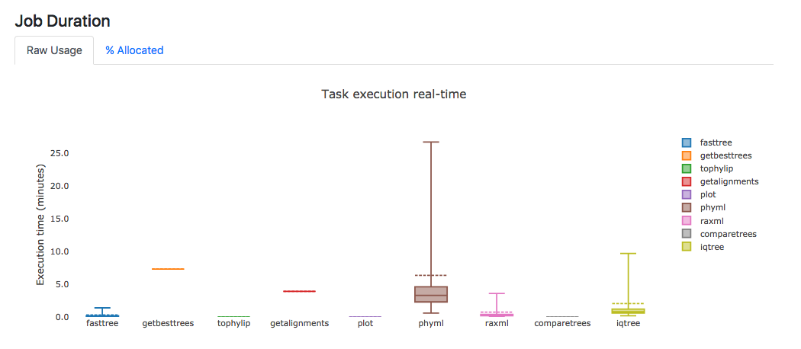

# Nextflow

## Commands
### Dl data

```
# Single gene alignments
wget -O single-gene_alignments.tar.bz2  https://ndownloader.figshare.com/files/9473962
# Single gene trees
wget -O single-gene_trees.tar.bz2 https://ndownloader.figshare.com/files/9473953
```

### Extract data

```
# Single gene alignments
tar -xjvf single-gene_alignments.tar.bz2 single-gene_alignments/SongD1/
# Single gene trees
tar -xjf single-gene_trees.tar.bz2 single-gene_trees/SongD1/
```

### Tree inference commands

```
FastTree -nt -gtr -gamma -spr 4 -mlacc 2 -slownni !{align} > !{align}.nhx
raxmlHPC -T !{task.cpus} -p 1 -m GTRGAMMA --no-bfgs -s !{align} -n !{align}
goalign reformat phylip -i !{align} -o !{align.baseName}.phy
phyml -i !{align} --r_seed 1 -d nt -b 0 -m GTR -f e -c 4 -a e -s SPR --n_rand_starts 1 -o tlr -p --run_id ID
iqtree -m GTR+G4 -s !{align} -seed 1 -nt !{task.cpus}
```

## Workflow

[](images/nf_dag.dot)

## Machine

Launched on a 128 cpus machine on [IFB cloud](https://biosphere.france-bioinformatique.fr/catalogue/appliance/119/).

### Data extraction

[](images/data_extraction.png)

### Analysis started

[](images/analysis_started.png)

## Results

### Histogram for SongD1 dataset



|  method   |  &ne; Best |  = Best    |
|-----------|------------|------------|
|  fasttree |  0.9622642 | 0.03773585 |
|  iqtree   |  0.1981132 | 0.80188679 |
|  phyml    |  0.4528302 | 0.54716981 |
|  raxml    |  0.4245283 | 0.57547170 |


### Report



### CPU Usage



### Memory Usage



### Job Duration


